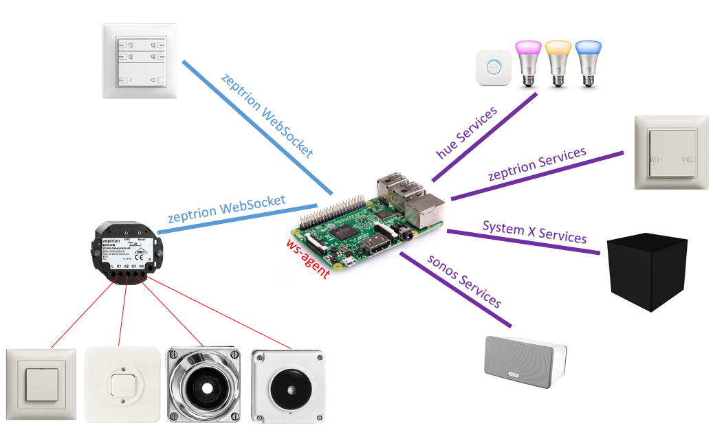

# zeptrion-websocket

You can send any web-sevices from a zeptrionAir cover as described in the project https://github.com/woodworm/hue-on-zeptrion.
However, with this solution you can only trigger web-services with a button press-event.
If you need also a trigger on button release-event, is the solution with the web-sockets more flexible for you.

The use cases could look like this:
```
"on button press"   : "dim up"
"on button release" : "stop dimming"
```
```
"on button press"   : "start timer interval"
"on timer event"    : "increase volume 1 step"
"on timer event"    : "increase volume 1 step"
"on timer event"    : "increase volume 1 step"
"on timer event"    : "increase volume 1 step"
"on button release" : "stop timer"
```
```
"on button press"   : "start timer interval"
"on timer event"    : "random ligth color"
"on timer event"    : "random ligth color"
"on timer event"    : "random ligth color"
"on button release" : "stop timer"
```

Now... since firmware version 01.08.26 supports Feller on their zeptrionAir devices websockets! To know how it works, visit the following address with your web browser.

```
http://<zeptrionAir ip address>/ws.html
```
 or
```
http://<zeptrionAir ip address>/smf.html
```

You will see as soon as you press a button on the zeptrionAir cover you will get
a websoket message like this ```{"eid2":{"bta":"...P..P.."}}``` or this  ```{"eid2":{"bta":"..P......"}} ``` or something similar. The message itself is packed into the event-id-2 ```eid2``` as button-array ```bta```. Each array position represent the button state pressed ```P``` or released ```.```


## potential installation

